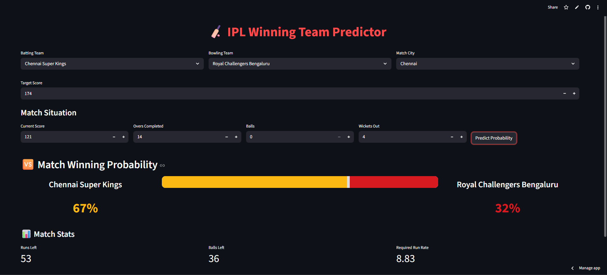

# 🏏 IPL Winning Team Prediction

A **Machine Learning-based web application** that predicts the **winning probability of an IPL team during a match** based on the current match situation.

The application analyzes match parameters such as score, overs completed, wickets fallen, target score, and teams involved to estimate the probability of the batting team winning the match.

The model is trained using **historical IPL match data** and deployed using **Streamlit** to provide an interactive web interface.

---

# 🚀 Live Demo

🔗 **Try the App Here:**  
https://ipl-winning-team-prediction-qzdpswxzsa25jgzpzddpp8.streamlit.app/

---

## 📸 Application Screenshot


---

# ✨ Features

- Predict **match-winning probability** during a live IPL match situation
- Interactive **Streamlit web application**
- Visual **win probability bar**
- Displays important match statistics:
  - Runs Left
  - Balls Left
  - Required Run Rate
- Supports **all current IPL teams**
- Clean and responsive UI

---

# 🧠 Machine Learning Model

The model predicts the probability of the batting team winning using the following features:

- Batting Team
- Bowling Team
- Match City
- Runs Left
- Balls Left
- Wickets Remaining
- Target Score
- Current Run Rate (CRR)
- Required Run Rate (RRR)

The trained machine learning pipeline is stored as: pipe.pkl
and loaded in the Streamlit application for prediction.

---

## 📂 Project Structure

```
IPL-Winning-Team-Prediction
│
├── app.py
├── pipe.pkl
├── matches.csv
├── deliveries.zip
├── requirements.txt
├── screenshot.png
└── README.md
```
### File Description

- **app.py** – Streamlit web application for prediction  
- **pipe.pkl** – Trained machine learning pipeline  
- **IPL Winning Team Prediction.ipynb** – Notebook used for data preprocessing and model training  
- **matches.csv** – Match-level IPL dataset  
- **deliveries.zip** – Compressed ball-by-ball IPL dataset  
- **screenshot.png** – Application UI screenshot  

---

# 📊 Dataset

The project uses historical IPL datasets:

### matches.csv
Contains match-level information such as:

- Teams
- Venue
- City
- Match results

### deliveries.zip
A compressed dataset containing **ball-by-ball IPL match data**.

To use it:

1. Download `deliveries.zip`
2. Extract the file
3. You will get `deliveries.csv`
4. Place `deliveries.csv` in the project directory

The datasets are used to generate important match features such as:

- Runs Left
- Balls Left
- Current Run Rate
- Required Run Rate

---

# 👨‍💻 Author

**Swarnadip Patra**  

---


